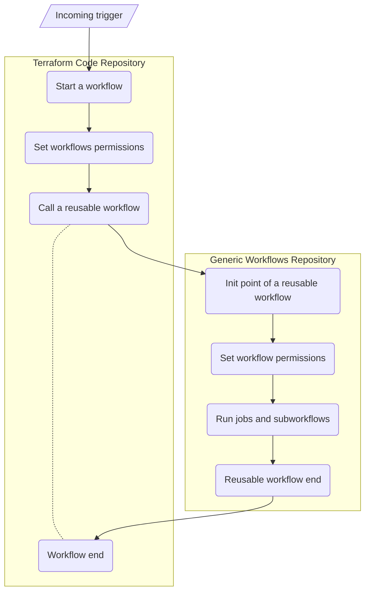
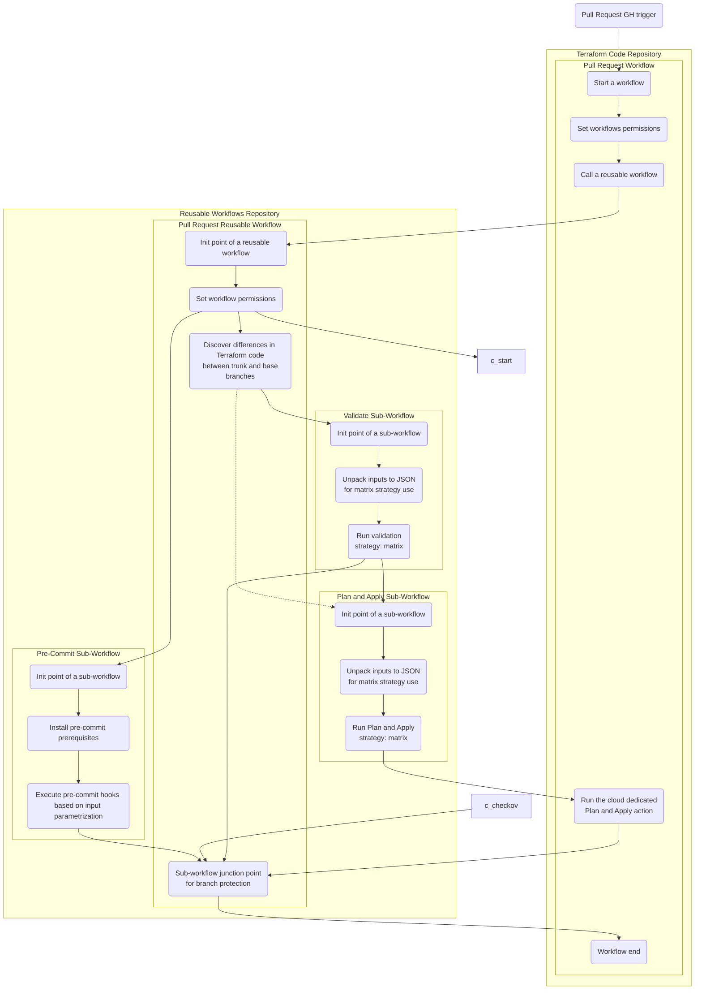

# CI workflows used by Terraform-(AWS|Azure|GCP)-modules-vmseries repositories.

This is a repository for hosting all reusable workflows used by the *code* repositories:

* [terraform-aws-vmseries-modules](https://github.com/PaloAltoNetworks/terraform-aws-vmseries-modules)
* [terraform-azurerm-vmseries-modules](https://github.com/PaloAltoNetworks/terraform-azurerm-vmseries-modules)
* [terraform-google-vmseries-modules](https://github.com/PaloAltoNetworks/terraform-google-vmseries-modules)

All GitHub actions workflows stored on the target/code repositories are only stubs calling reusable workflows stored here. Since the workflows stored here are used for generic actions like release/PR management this repository provides a way to have common code for actions that should be the same for each repository.

Notice, that those workflows match the way we work with the code repositories. They do not have to necessarily match any use case around releasing and PRs.

## Workflow diagram

### Generic 

The generic diagram below is to visualize dependencies and relationships between workflows in the code and this repository.



### Pull Requests

The diagram below shows detailed dependencies between both repositories using the [`PR CI`](./.github/workflows/pr_ci.yml) workflow.



## Usage

The code stored here is using Semantic Versioning and follows the GitHub actions way of providing tags for major releases. Therefore one can pin to a tag i.e. `v1` which will follow all minor and patch releases.

Please keep in mind that all workflows stored here use `permissions` property. Keep that in mind when referencing a workflow from this repository in your code - the permission you give to a reusable workflow in your code should match a summary of permissions used by all jobs in that particular reusable workflow.

An example of calling a reusable workflow.

```yaml
name: Lint PR Title
run-name: "Lint PR - (#${{ github.event.number }}) ${{ github.event.pull_request.title }}"

permissions:
  pull-requests: read

on:
  pull_request_target:
    types:
      - opened
      - edited
      - synchronize

jobs:
  lint_pr_title:
    name: Lint PR
    uses: PaloAltoNetworks/terraform-modules-vmseries-ci-workflows/.github/workflows/lint_pr_title.yml@v0
```

## Inputs/Outputs

None of the workflows takes any input nor they produce artifacts as output.
